#  IBM ML Course 4 — Wholesale Customer Segmentation (Unsupervised ML)

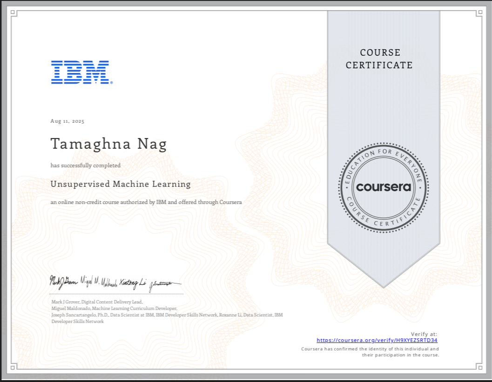{: style="width:75%"}  
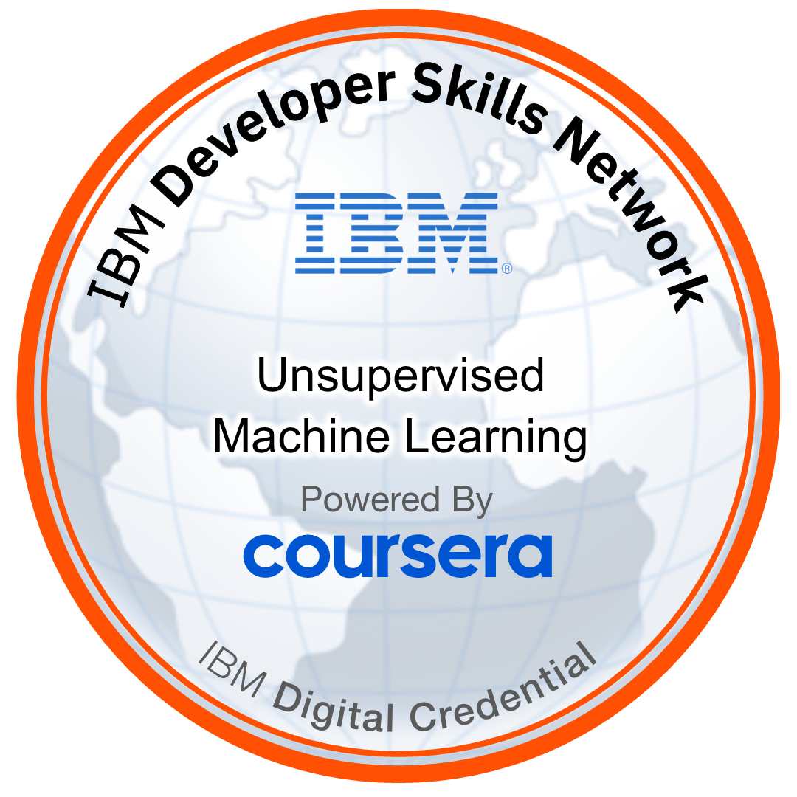

---

## 📖 Executive Summary
This project delivers an **end-to-end unsupervised machine learning pipeline** for **Wholesale Customer Segmentation** using purchase data.  
The aim is to **uncover hidden patterns** in customer purchasing behaviors and translate them into actionable business insights for targeted marketing, optimized inventory, and sales strategy.

The work was completed as part of the  
**IBM Machine Learning Professional Certificate – Course 4: Unsupervised Learning**.  
It blends **statistical insight, dimensionality reduction, and clustering algorithms** into a reproducible, production-ready workflow.

---

## 🛠️ Technology & Tools

**Languages & Environment**  
- Python (3.11)  
- Jupyter Notebook & Google Colab  

**Core Libraries**  
- `numpy`, `pandas` — data handling  
- `matplotlib`, `seaborn`, `plotly` — visualization  
- `scikit-learn` — clustering, preprocessing, PCA, t-SNE, UMAP  
- `yellowbrick` — model diagnostics  
- `scipy` — hierarchical clustering  

---

## 📂 Dataset

**Source:** UCI Machine Learning Repository — *Wholesale customers data set*  

**Features**  
- Annual spending on product categories: *Fresh*, *Milk*, *Grocery*, *Frozen*, *Detergents_Paper*, *Delicassen*  
- Channels: *Hotel/Restaurant/Cafe* (HORECA) vs *Retail*  
- Regions: *Lisbon*, *Oporto*, *Other*

---

## 🔬 Methodology

### 1️⃣ Data Exploration & Preprocessing
- **Null Values**: Confirmed dataset completeness.  
- **Scale Normalization**: Applied `StandardScaler` to prevent dominance of high-scale features.  
- **Correlation Analysis**: Heatmap revealed high correlation between *Grocery* and *Detergents_Paper*.  

**Visuals:**  
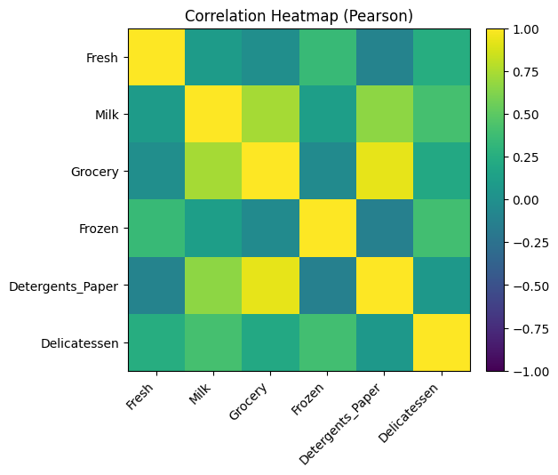

---

### 2️⃣ Dimensionality Reduction
**Principal Component Analysis (PCA)**  
- Reduced feature space while retaining ~85% of variance in first few components.  
- PCA Loadings identified **Grocery** & **Detergents_Paper** as heavy influencers for PC1.

**Non-linear Embeddings:**  
- **t-SNE**: Captured non-linear separations for better cluster intuition.  
- **UMAP**: Produced dense, interpretable manifolds for DBSCAN clustering.

**Visuals:**  
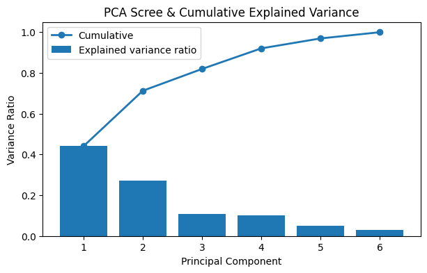  
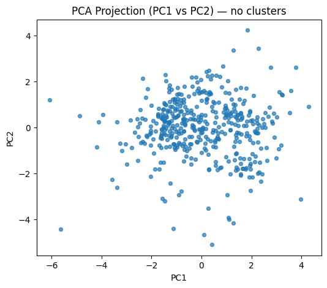  
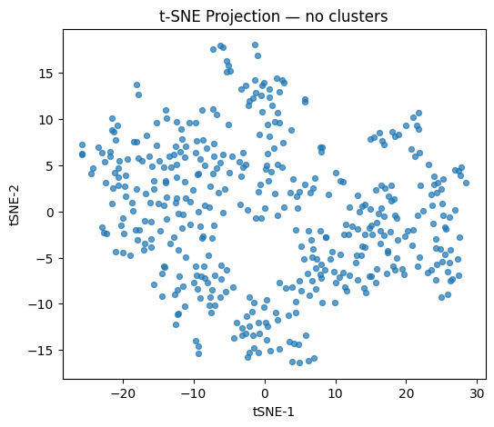  
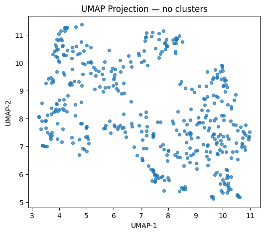

---

### 3️⃣ Clustering Algorithms & Evaluation

#### K-Means
- **Optimal K**: Determined via Elbow & Silhouette methods.
- Produced **well-separated, interpretable clusters**.

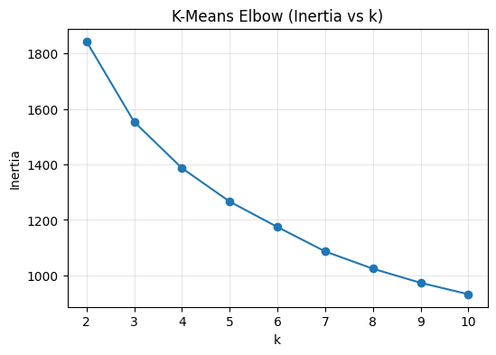

#### Agglomerative Clustering
- Applied to PCA-transformed data.
- Dendrogram analysis supported K=3 segmentation.

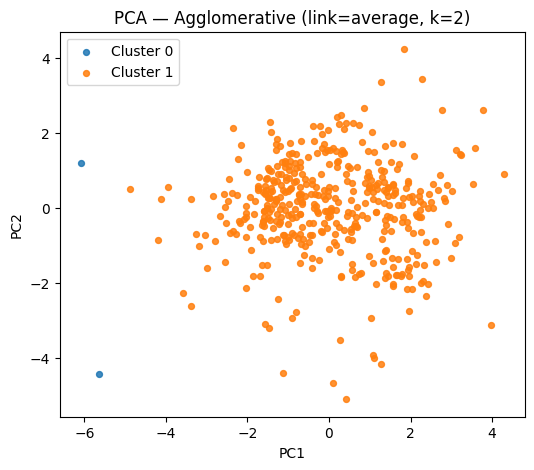

#### DBSCAN
- Applied to UMAP embedding.
- Useful for **detecting noise/outliers** alongside core clusters.

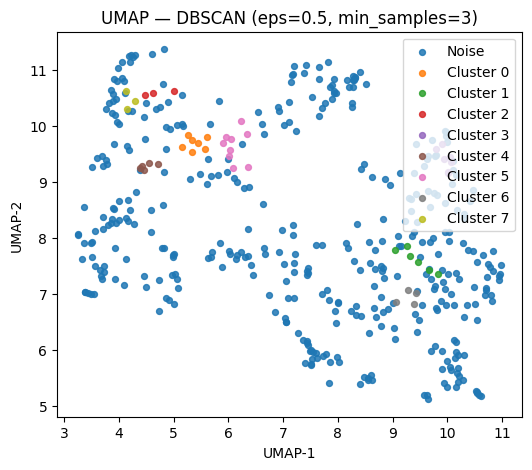

---

### 4️⃣ Model Comparison
All algorithms were benchmarked on **Silhouette Score** and **Cluster Cohesion**.

**Visual:**  
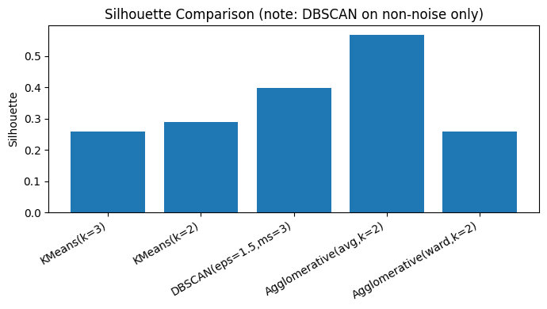

---

## 📊 Results & Business Insights

1. **Three primary customer segments** emerged:  
   - *High Grocery/Detergents buyers* — likely large retailers.  
   - *Fresh-focused buyers* — possible restaurants or produce-heavy businesses.  
   - *Balanced spenders* — medium-size retail with diversified orders.

2. **PCA Loadings** revealed:
   - *Grocery* & *Detergents_Paper* drive differentiation for large retailers.
   - *Fresh* dominates in foodservice-heavy segments.

3. **Actionable Recommendations**:
   - **Retailers**: Push bundled offers for grocery + detergents.
   - **HORECA clients**: Focus promotions on fresh produce and perishables.
   - **Balanced buyers**: Explore cross-category loyalty programs.

---

## 🎓 Certificate


---

## 🏆 Badge


---

## 📁 Repository Structure
```plaintext
├── data/
│   └── W_cust_data.csv
├── notebooks/
│   ├── EDA_and_Preprocessing.ipynb
│   ├── Dimensionality_Reduction.ipynb
│   ├── Clustering_Experiments.ipynb
├── results/
│   ├── correlation_heatmap.png
│   ├── pca_scree_and_cumulative.png
│   ├── pca_proj_pca1_pca2.png
│   ├── t-SNE_projection.png
│   ├── UMAP_projection.png
│   ├── lmeans_elbow.png
│   ├── pca_agglomerative.png
│   ├── UMAP_DBSCAN.png
│   ├── allalgocompare.png
└── README.md
